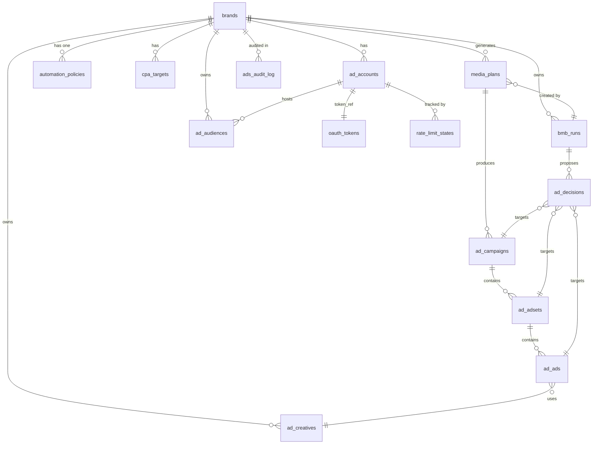
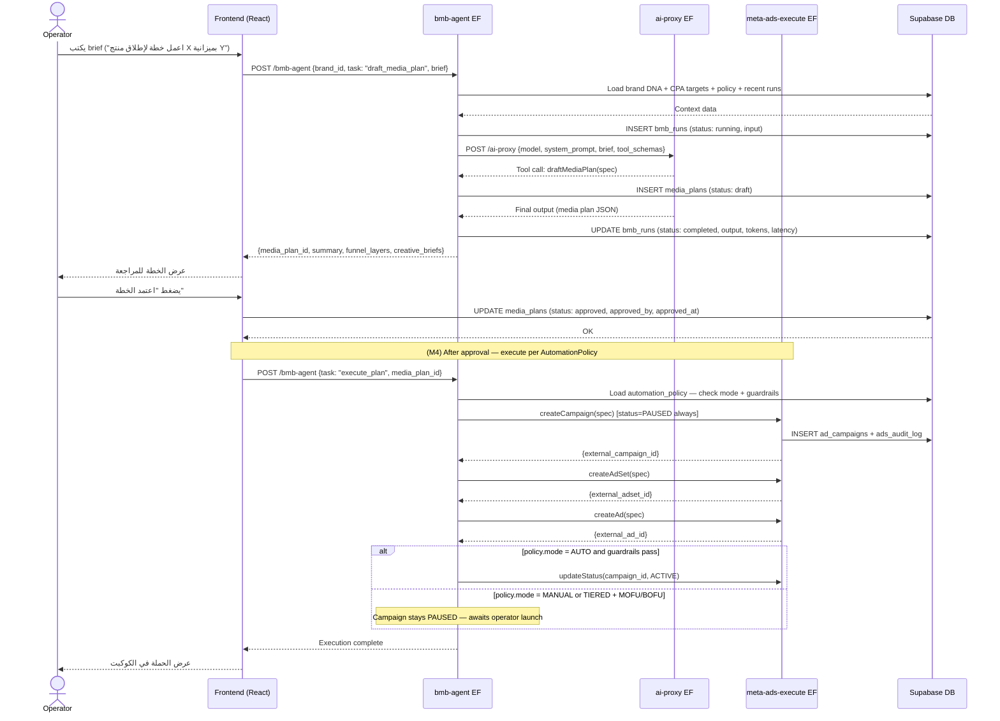
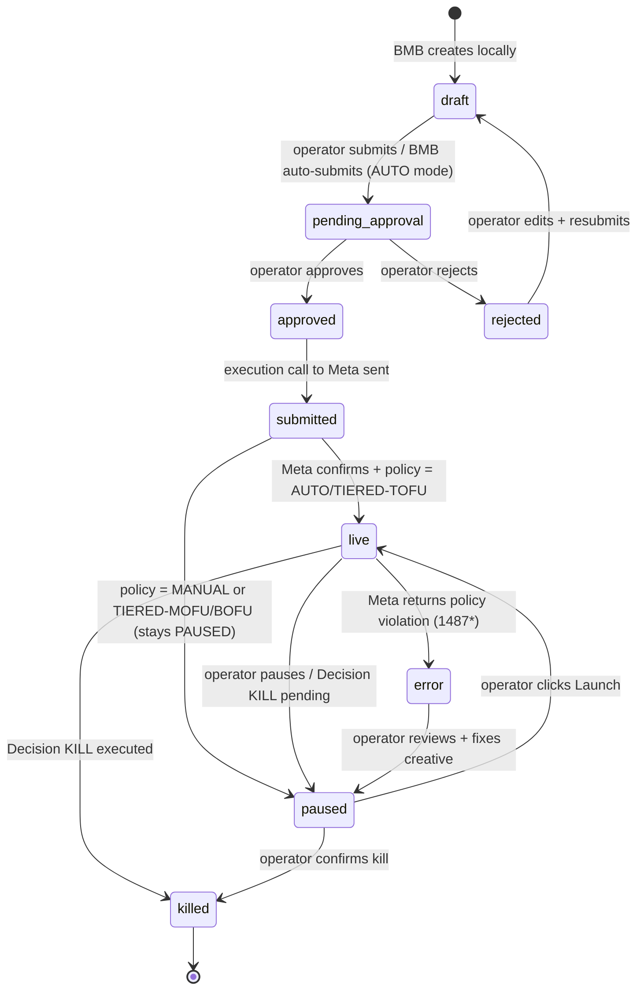

# Ads Module — Phase 2: Architecture & Plan

**Date:** 2026-05-02
**Author:** Lead AI/Backend Engineer (BMB Agent Build)
**Stack:** Vite + React 19 · Supabase PostgreSQL · Deno Edge Functions · pg_cron

> All architecture adapts the spec's intent to the **actual** stack.
> Nest.js → Deno Edge Functions. Prisma → SQL migrations. BullMQ → pg_cron + job_queue. Redis → EF in-memory + Supabase tables.

---

## 1. Domain Model — SQL Schema

New migrations: **053** through **057** (additive, no breaking changes to existing tables).

---

### Migration 053 — Ad Accounts, Adsets, Ads, Creatives, Audiences

```sql
-- ── ad_accounts ───────────────────────────────────────────────────────────────
-- One row per provider per brand. Replaces mocked adAccountService.ts.
CREATE TABLE IF NOT EXISTS ad_accounts (
  id                  UUID        PRIMARY KEY DEFAULT gen_random_uuid(),
  brand_id            UUID        NOT NULL REFERENCES brands(id) ON DELETE CASCADE,
  provider            TEXT        NOT NULL,  -- 'meta' | 'google_ads' | 'tiktok_ads'
  external_id         TEXT        NOT NULL,  -- act_xxxxxxxxx (Meta) or customer ID (Google)
  name                TEXT        NOT NULL,
  currency            TEXT        NOT NULL DEFAULT 'EGP',
  timezone_name       TEXT        NOT NULL DEFAULT 'Africa/Cairo',
  business_id         TEXT,                  -- Meta BM ID
  page_id             TEXT,                  -- Primary Facebook Page
  ig_account_id       TEXT,                  -- Instagram Account ID
  pixel_id            TEXT,                  -- Meta Pixel ID
  token_ref           UUID        REFERENCES oauth_tokens(id) ON DELETE SET NULL,
  connection_health   TEXT        NOT NULL DEFAULT 'healthy',
  -- 'healthy' | 'degraded' | 'disconnected'
  meta_connected      BOOLEAN     NOT NULL DEFAULT false,
  connected_at        TIMESTAMPTZ,
  last_verified_at    TIMESTAMPTZ,
  created_at          TIMESTAMPTZ NOT NULL DEFAULT now(),
  updated_at          TIMESTAMPTZ NOT NULL DEFAULT now(),
  CONSTRAINT ad_accounts_brand_provider_unique UNIQUE (brand_id, provider)
);
ALTER TABLE ad_accounts ENABLE ROW LEVEL SECURITY;
CREATE POLICY "ad_accounts_brand_members" ON ad_accounts
  USING (brand_id IN (SELECT brand_id FROM brand_members WHERE user_id = auth.uid()));

-- ── cpa_targets ───────────────────────────────────────────────────────────────
-- Per-brand, per-funnel-layer CPA targets. BMB reads these for every decision.
CREATE TABLE IF NOT EXISTS cpa_targets (
  id          UUID    PRIMARY KEY DEFAULT gen_random_uuid(),
  brand_id    UUID    NOT NULL REFERENCES brands(id) ON DELETE CASCADE,
  funnel_layer TEXT   NOT NULL,  -- 'tofu' | 'mofu' | 'bofu'
  target_cpa  NUMERIC NOT NULL,
  currency    TEXT    NOT NULL DEFAULT 'EGP',
  updated_at  TIMESTAMPTZ NOT NULL DEFAULT now(),
  updated_by  UUID    REFERENCES auth.users(id),
  CONSTRAINT cpa_targets_brand_layer_unique UNIQUE (brand_id, funnel_layer)
);
ALTER TABLE cpa_targets ENABLE ROW LEVEL SECURITY;
CREATE POLICY "cpa_targets_brand_members" ON cpa_targets
  USING (brand_id IN (SELECT brand_id FROM brand_members WHERE user_id = auth.uid()));

-- ── Extend ad_campaigns with funnel layer + internal status ───────────────────
ALTER TABLE ad_campaigns
  ADD COLUMN IF NOT EXISTS funnel_layer TEXT DEFAULT 'tofu',
  -- 'tofu' | 'mofu' | 'bofu'
  ADD COLUMN IF NOT EXISTS internal_status TEXT NOT NULL DEFAULT 'draft',
  -- 'draft' | 'pending_approval' | 'submitted' | 'live' | 'paused' | 'killed' | 'error'
  ADD COLUMN IF NOT EXISTS ad_account_uuid UUID REFERENCES ad_accounts(id),
  ADD COLUMN IF NOT EXISTS media_plan_id   UUID,  -- FK added after media_plans table
  ADD COLUMN IF NOT EXISTS error_message   TEXT,
  ADD COLUMN IF NOT EXISTS fbtrace_id      TEXT;  -- Meta fbtrace_id for last error

-- ── ad_adsets ─────────────────────────────────────────────────────────────────
CREATE TABLE IF NOT EXISTS ad_adsets (
  id                    UUID    PRIMARY KEY DEFAULT gen_random_uuid(),
  brand_id              UUID    NOT NULL REFERENCES brands(id) ON DELETE CASCADE,
  campaign_id           UUID    NOT NULL REFERENCES ad_campaigns(id) ON DELETE CASCADE,
  ad_account_uuid       UUID    REFERENCES ad_accounts(id),
  external_id           TEXT,   -- Meta adset ID (null until submitted)
  name                  TEXT    NOT NULL,
  status                TEXT    NOT NULL DEFAULT 'active',  -- Meta status
  internal_status       TEXT    NOT NULL DEFAULT 'draft',
  funnel_layer          TEXT    NOT NULL DEFAULT 'tofu',
  daily_budget          NUMERIC,
  lifetime_budget       NUMERIC,
  bid_strategy          TEXT,
  targeting             JSONB   NOT NULL DEFAULT '{}',
  optimization_goal     TEXT,
  billing_event         TEXT,
  start_time            TIMESTAMPTZ,
  end_time              TIMESTAMPTZ,
  frequency             NUMERIC,  -- latest frequency from insights
  error_message         TEXT,
  fbtrace_id            TEXT,
  created_at            TIMESTAMPTZ NOT NULL DEFAULT now(),
  updated_at            TIMESTAMPTZ NOT NULL DEFAULT now()
);
ALTER TABLE ad_adsets ENABLE ROW LEVEL SECURITY;
CREATE POLICY "ad_adsets_brand_members" ON ad_adsets
  USING (brand_id IN (SELECT brand_id FROM brand_members WHERE user_id = auth.uid()));
CREATE INDEX idx_ad_adsets_campaign ON ad_adsets (campaign_id);
CREATE INDEX idx_ad_adsets_brand    ON ad_adsets (brand_id, internal_status);

-- ── ad_ads ────────────────────────────────────────────────────────────────────
CREATE TABLE IF NOT EXISTS ad_ads (
  id              UUID    PRIMARY KEY DEFAULT gen_random_uuid(),
  brand_id        UUID    NOT NULL REFERENCES brands(id) ON DELETE CASCADE,
  adset_id        UUID    NOT NULL REFERENCES ad_adsets(id) ON DELETE CASCADE,
  external_id     TEXT,
  name            TEXT    NOT NULL,
  status          TEXT    NOT NULL DEFAULT 'active',
  internal_status TEXT    NOT NULL DEFAULT 'draft',
  creative_id     UUID,   -- FK added after ad_creatives
  error_message   TEXT,
  fbtrace_id      TEXT,
  created_at      TIMESTAMPTZ NOT NULL DEFAULT now(),
  updated_at      TIMESTAMPTZ NOT NULL DEFAULT now()
);
ALTER TABLE ad_ads ENABLE ROW LEVEL SECURITY;
CREATE POLICY "ad_ads_brand_members" ON ad_ads
  USING (brand_id IN (SELECT brand_id FROM brand_members WHERE user_id = auth.uid()));
CREATE INDEX idx_ad_ads_adset ON ad_ads (adset_id);

-- ── ad_creatives ──────────────────────────────────────────────────────────────
CREATE TABLE IF NOT EXISTS ad_creatives (
  id              UUID    PRIMARY KEY DEFAULT gen_random_uuid(),
  brand_id        UUID    NOT NULL REFERENCES brands(id) ON DELETE CASCADE,
  external_id     TEXT,   -- Meta creative ID after upload
  name            TEXT    NOT NULL,
  headline        TEXT,
  primary_text    TEXT,
  description     TEXT,
  call_to_action  TEXT,
  media_urls      TEXT[]  NOT NULL DEFAULT '{}',  -- uploaded asset URLs (Supabase Storage)
  framework_tag   TEXT,   -- 'EIDA' | 'AIDA' | 'AR_HPESOS' | 'TEASER_BUILD_OWN'
  language        TEXT    NOT NULL DEFAULT 'ar',
  status          TEXT    NOT NULL DEFAULT 'draft',  -- 'draft' | 'uploaded' | 'active' | 'fatigued' | 'error'
  fatigue_score   NUMERIC,  -- 0–100 computed from frequency + CTR drop
  error_message   TEXT,
  created_at      TIMESTAMPTZ NOT NULL DEFAULT now(),
  updated_at      TIMESTAMPTZ NOT NULL DEFAULT now()
);
ALTER TABLE ad_creatives ENABLE ROW LEVEL SECURITY;
CREATE POLICY "ad_creatives_brand_members" ON ad_creatives
  USING (brand_id IN (SELECT brand_id FROM brand_members WHERE user_id = auth.uid()));

-- Backfill FK on ad_ads
ALTER TABLE ad_ads ADD CONSTRAINT fk_ad_ads_creative
  FOREIGN KEY (creative_id) REFERENCES ad_creatives(id) ON DELETE SET NULL;

-- ── ad_audiences ──────────────────────────────────────────────────────────────
CREATE TABLE IF NOT EXISTS ad_audiences (
  id              UUID    PRIMARY KEY DEFAULT gen_random_uuid(),
  brand_id        UUID    NOT NULL REFERENCES brands(id) ON DELETE CASCADE,
  ad_account_uuid UUID    REFERENCES ad_accounts(id),
  external_id     TEXT,   -- Meta audience ID after push
  name            TEXT    NOT NULL,
  audience_type   TEXT    NOT NULL,  -- 'custom' | 'lookalike' | 'saved'
  source          TEXT,              -- 'customer_list' | 'website' | 'engagement' | 'lookalike_source_id'
  source_size     INTEGER,
  approx_size     INTEGER,           -- Meta estimated size
  status          TEXT    NOT NULL DEFAULT 'pending',  -- 'pending' | 'ready' | 'error'
  spec            JSONB   NOT NULL DEFAULT '{}',  -- full audience spec (no PII — only hashed references)
  error_message   TEXT,
  created_at      TIMESTAMPTZ NOT NULL DEFAULT now(),
  updated_at      TIMESTAMPTZ NOT NULL DEFAULT now()
);
ALTER TABLE ad_audiences ENABLE ROW LEVEL SECURITY;
CREATE POLICY "ad_audiences_brand_members" ON ad_audiences
  USING (brand_id IN (SELECT brand_id FROM brand_members WHERE user_id = auth.uid()));
```

---

### Migration 054 — Media Plans & Automation Policy

```sql
-- ── automation_policies ───────────────────────────────────────────────────────
CREATE TABLE IF NOT EXISTS automation_policies (
  id                          UUID      PRIMARY KEY DEFAULT gen_random_uuid(),
  brand_id                    UUID      NOT NULL REFERENCES brands(id) ON DELETE CASCADE,
  mode                        TEXT      NOT NULL DEFAULT 'manual',
  -- 'manual' | 'auto' | 'tiered'
  max_auto_launch_adset_budget NUMERIC  NOT NULL DEFAULT 500,
  approved_template_ids       TEXT[]   NOT NULL DEFAULT '{}',
  max_auto_scale_percent      INTEGER  NOT NULL DEFAULT 20,
  kill_cpa_multiplier         NUMERIC  NOT NULL DEFAULT 2.0,
  kill_window_hours           INTEGER  NOT NULL DEFAULT 48,
  max_daily_spend_per_campaign NUMERIC NOT NULL DEFAULT 2000,
  max_adsets_per_campaign     INTEGER  NOT NULL DEFAULT 10,
  max_concurrent_live_campaigns INTEGER NOT NULL DEFAULT 15,
  tiered_auto_launch_layers   TEXT[]   NOT NULL DEFAULT '{tofu}',
  monthly_budget              NUMERIC,   -- hard cap: if MTD spend > 90% → block auto-launch
  updated_at                  TIMESTAMPTZ NOT NULL DEFAULT now(),
  updated_by                  UUID     REFERENCES auth.users(id),
  CONSTRAINT automation_policies_brand_unique UNIQUE (brand_id)
);
ALTER TABLE automation_policies ENABLE ROW LEVEL SECURITY;
CREATE POLICY "automation_policies_brand_members" ON automation_policies
  USING (brand_id IN (SELECT brand_id FROM brand_members WHERE user_id = auth.uid()));

-- ── media_plans ───────────────────────────────────────────────────────────────
CREATE TABLE IF NOT EXISTS media_plans (
  id              UUID    PRIMARY KEY DEFAULT gen_random_uuid(),
  brand_id        UUID    NOT NULL REFERENCES brands(id) ON DELETE CASCADE,
  name            TEXT    NOT NULL,
  objective       TEXT    NOT NULL,  -- 'OUTCOME_AWARENESS' | 'OUTCOME_TRAFFIC' | 'OUTCOME_LEADS' | 'OUTCOME_SALES'
  status          TEXT    NOT NULL DEFAULT 'draft',
  -- 'draft' | 'pending_approval' | 'approved' | 'executing' | 'live' | 'completed' | 'rejected'
  total_budget    NUMERIC NOT NULL,
  currency        TEXT    NOT NULL DEFAULT 'EGP',
  start_date      DATE,
  end_date        DATE,
  brief           TEXT,              -- operator's original brief (Arabic)
  strategy_summary TEXT,             -- BMB-generated summary
  funnel_layers   JSONB   NOT NULL DEFAULT '{}',
  -- { tofu: { budget, kpis, audience_notes }, mofu: {...}, bofu: {...} }
  kpis            JSONB   NOT NULL DEFAULT '{}',
  -- { cpa_target, roas_target, impression_target, ... }
  creative_briefs JSONB   NOT NULL DEFAULT '[]',
  -- array of creative brief objects per funnel layer
  audience_plan   JSONB   NOT NULL DEFAULT '[]',
  -- array of audience specs (not yet pushed to Meta)
  approved_by     UUID    REFERENCES auth.users(id),
  approved_at     TIMESTAMPTZ,
  rejected_reason TEXT,
  bmb_run_id      UUID,   -- FK added after bmb_runs
  created_at      TIMESTAMPTZ NOT NULL DEFAULT now(),
  updated_at      TIMESTAMPTZ NOT NULL DEFAULT now()
);
ALTER TABLE media_plans ENABLE ROW LEVEL SECURITY;
CREATE POLICY "media_plans_brand_members" ON media_plans
  USING (brand_id IN (SELECT brand_id FROM brand_members WHERE user_id = auth.uid()));
CREATE INDEX idx_media_plans_brand_status ON media_plans (brand_id, status);

-- Backfill FK on ad_campaigns
ALTER TABLE ad_campaigns ADD CONSTRAINT fk_ad_campaigns_media_plan
  FOREIGN KEY (media_plan_id) REFERENCES media_plans(id) ON DELETE SET NULL;
```

---

### Migration 055 — BMB Runs & Decisions

```sql
-- ── bmb_runs ──────────────────────────────────────────────────────────────────
CREATE TABLE IF NOT EXISTS bmb_runs (
  id              UUID    PRIMARY KEY DEFAULT gen_random_uuid(),
  brand_id        UUID    NOT NULL REFERENCES brands(id) ON DELETE CASCADE,
  run_type        TEXT    NOT NULL,
  -- 'on_demand' | 'scheduled_insights' | 'scheduled_decisions' | 'scheduled_pl'
  -- | 'triggered_fatigue' | 'triggered_cpa_breach' | 'triggered_disapproval'
  trigger         TEXT    NOT NULL,  -- 'operator' | 'pg_cron' | 'webhook'
  status          TEXT    NOT NULL DEFAULT 'running',
  -- 'running' | 'completed' | 'failed' | 'timeout'
  input           JSONB   NOT NULL DEFAULT '{}',  -- operator brief or trigger payload
  output          JSONB,                           -- structured output (plan, decisions, report)
  tool_calls      JSONB   NOT NULL DEFAULT '[]',  -- array of tool invocations with latency
  model           TEXT    NOT NULL DEFAULT 'gemini-2.5-pro',
  input_tokens    INTEGER,
  output_tokens   INTEGER,
  cost_usd        NUMERIC(10,6),
  latency_ms      INTEGER,
  error_message   TEXT,
  created_at      TIMESTAMPTZ NOT NULL DEFAULT now(),
  completed_at    TIMESTAMPTZ
);
ALTER TABLE bmb_runs ENABLE ROW LEVEL SECURITY;
CREATE POLICY "bmb_runs_brand_members" ON bmb_runs
  USING (brand_id IN (SELECT brand_id FROM brand_members WHERE user_id = auth.uid()));
CREATE INDEX idx_bmb_runs_brand ON bmb_runs (brand_id, run_type, created_at DESC);

-- Backfill FK on media_plans
ALTER TABLE media_plans ADD CONSTRAINT fk_media_plans_bmb_run
  FOREIGN KEY (bmb_run_id) REFERENCES bmb_runs(id) ON DELETE SET NULL;

-- ── ad_decisions ──────────────────────────────────────────────────────────────
CREATE TABLE IF NOT EXISTS ad_decisions (
  id              UUID    PRIMARY KEY DEFAULT gen_random_uuid(),
  brand_id        UUID    NOT NULL REFERENCES brands(id) ON DELETE CASCADE,
  bmb_run_id      UUID    REFERENCES bmb_runs(id) ON DELETE SET NULL,
  target_type     TEXT    NOT NULL,  -- 'campaign' | 'adset' | 'ad'
  target_id       UUID    NOT NULL,  -- references ad_campaigns | ad_adsets | ad_ads
  decision_type   TEXT    NOT NULL,  -- 'scale' | 'kill' | 'duplicate' | 'refresh' | 'review' | 'hold'
  status          TEXT    NOT NULL DEFAULT 'pending',
  -- 'pending' | 'approved' | 'rejected' | 'executed' | 'failed'
  reasoning       TEXT    NOT NULL,
  supporting_metrics JSONB NOT NULL DEFAULT '{}',
  -- { cpa, target_cpa, cpa_multiplier, frequency, ctr_drop_pct, spend, conversions, ... }
  scale_percent   INTEGER,       -- if decision_type = 'scale'
  new_budget      NUMERIC,       -- if decision_type = 'scale' vertical
  source_id       UUID,          -- if decision_type = 'duplicate', source adset/ad
  approved_by     UUID    REFERENCES auth.users(id),
  approved_at     TIMESTAMPTZ,
  rejected_reason TEXT,
  executed_at     TIMESTAMPTZ,
  fbtrace_id      TEXT,          -- Meta fbtrace_id from execution call
  error_message   TEXT,
  created_at      TIMESTAMPTZ NOT NULL DEFAULT now(),
  updated_at      TIMESTAMPTZ NOT NULL DEFAULT now()
);
ALTER TABLE ad_decisions ENABLE ROW LEVEL SECURITY;
CREATE POLICY "ad_decisions_brand_members" ON ad_decisions
  USING (brand_id IN (SELECT brand_id FROM brand_members WHERE user_id = auth.uid()));
CREATE INDEX idx_ad_decisions_brand_status ON ad_decisions (brand_id, status, created_at DESC);
CREATE INDEX idx_ad_decisions_pending      ON ad_decisions (brand_id, status) WHERE status = 'pending';
```

---

### Migration 056 — Rate Limit State & Audit Log

```sql
-- ── rate_limit_states ─────────────────────────────────────────────────────────
CREATE TABLE IF NOT EXISTS rate_limit_states (
  id              UUID    PRIMARY KEY DEFAULT gen_random_uuid(),
  ad_account_id   UUID    NOT NULL REFERENCES ad_accounts(id) ON DELETE CASCADE,
  bucket          TEXT    NOT NULL,  -- 'app' | 'ad_account' | 'page'
  call_count_pct  NUMERIC NOT NULL DEFAULT 0,
  total_cputime_pct NUMERIC NOT NULL DEFAULT 0,
  total_time_pct  NUMERIC NOT NULL DEFAULT 0,
  type            TEXT,              -- BUC type from header
  estimated_time_to_regain_access INTEGER,  -- seconds
  observed_at     TIMESTAMPTZ NOT NULL DEFAULT now(),
  CONSTRAINT rate_limit_states_account_bucket UNIQUE (ad_account_id, bucket)
);
CREATE INDEX idx_rate_limit_states_account ON rate_limit_states (ad_account_id);

-- ── ads_audit_log ─────────────────────────────────────────────────────────────
-- Append-only log of every state change on campaigns/adsets/ads/decisions/policies.
CREATE TABLE IF NOT EXISTS ads_audit_log (
  id          UUID    PRIMARY KEY DEFAULT gen_random_uuid(),
  brand_id    UUID    NOT NULL REFERENCES brands(id) ON DELETE CASCADE,
  entity_type TEXT    NOT NULL,  -- 'campaign' | 'adset' | 'ad' | 'decision' | 'policy'
  entity_id   UUID    NOT NULL,
  action      TEXT    NOT NULL,  -- 'created' | 'status_changed' | 'budget_updated' | 'approved' | 'executed' | ...
  actor_type  TEXT    NOT NULL,  -- 'operator' | 'bmb' | 'system'
  actor_id    TEXT,              -- user UUID or 'bmb:{run_id}'
  before_state JSONB,
  after_state  JSONB,
  mode_at_time TEXT,             -- automation policy mode at time of action
  fbtrace_id  TEXT,
  created_at  TIMESTAMPTZ NOT NULL DEFAULT now()
);
ALTER TABLE ads_audit_log ENABLE ROW LEVEL SECURITY;
CREATE POLICY "ads_audit_log_brand_members" ON ads_audit_log
  USING (brand_id IN (SELECT brand_id FROM brand_members WHERE user_id = auth.uid()));
CREATE INDEX idx_ads_audit_log_entity   ON ads_audit_log (entity_type, entity_id, created_at DESC);
CREATE INDEX idx_ads_audit_log_brand    ON ads_audit_log (brand_id, created_at DESC);
```

---

### Migration 057 — Token Decrypt Log & Key Versioning

```sql
-- ── token_decrypt_logs ────────────────────────────────────────────────────────
CREATE TABLE IF NOT EXISTS token_decrypt_logs (
  id          UUID    PRIMARY KEY DEFAULT gen_random_uuid(),
  brand_id    UUID    REFERENCES brands(id) ON DELETE SET NULL,
  token_id    UUID    REFERENCES oauth_tokens(id) ON DELETE SET NULL,
  purpose     TEXT    NOT NULL,  -- 'ads_sync' | 'meta_execute' | 'audience_push' | 'token_verify'
  requestor   TEXT    NOT NULL,  -- edge function name
  created_at  TIMESTAMPTZ NOT NULL DEFAULT now()
);
CREATE INDEX idx_token_decrypt_logs_brand ON token_decrypt_logs (brand_id, created_at DESC);

-- Add key_version to oauth_tokens for future rotation
ALTER TABLE oauth_tokens ADD COLUMN IF NOT EXISTS key_version INTEGER NOT NULL DEFAULT 1;
```

---

## 2. Domain Model Diagram



---

## 3. BMB Agent Architecture

### 3.1 Per-Brand Factory Pattern (Edge Function)

The BMB is **not** a singleton. Each invocation is a fresh Deno Edge Function call hydrated with brand-specific context. There is no shared global state between brands.

**Edge Function:** `supabase/functions/bmb-agent/index.ts`

```
BMBAgent (per invocation)
├── Brand Context Loader
│   ├── getBrandDNA()          → brand_profiles.extended_profile
│   ├── getCPATargets()        → cpa_targets table
│   ├── getAutomationPolicy()  → automation_policies table
│   └── getRecentBMBRuns(3)    → bmb_runs table (last 3 summaries)
├── Tool Registry (brand-scoped)
│   ├── READ tools (safe, no Meta writes)
│   │   ├── getBrandDNA
│   │   ├── getRecentInsights(range)
│   │   ├── getRecentDecisions(n)
│   │   └── getActiveCampaigns
│   └── WRITE tools (gated by AutomationPolicy)
│       ├── draftMediaPlan(brief)     → writes media_plans row
│       ├── buildAudience(spec)       → calls meta-ads-execute EF
│       ├── uploadCreative(spec)      → calls meta-ads-execute EF
│       ├── createCampaign(spec)      → calls meta-ads-execute EF
│       ├── createAdSet(spec)         → calls meta-ads-execute EF
│       ├── createAd(spec)            → calls meta-ads-execute EF
│       ├── proposeDecision(spec)     → writes ad_decisions row
│       ├── pauseCampaign(id)         → calls meta-ads-execute EF
│       ├── updateBudget(id, budget)  → calls meta-ads-execute EF
│       └── duplicateAdSet(id, overrides) → calls meta-ads-execute EF
├── System Prompt Composer
│   └── buildBMBSystemPrompt(brandDNA, policy, recentRuns)
├── Gemini 2.5 Pro (via ai-proxy EF)
│   ├── Tool-use schema enforced via response_schema
│   └── Arabic output enforced via system prompt
├── Guardrail Layer (runs before any WRITE tool)
│   ├── check budget caps (policy.maxDailySpendPerCampaign)
│   ├── check MTD spend vs monthly_budget (90% threshold)
│   ├── check policy.mode allows this action
│   ├── check ad_account.connection_health != 'degraded'
│   └── check rate_limit_states (defer if > 75%)
└── BMBRun Logger
    └── writes bmb_runs row (input, output, tool_calls, tokens, latency)
```

### 3.2 Memory Layers

| Layer | Storage | Scope | TTL |
|---|---|---|---|
| Brand DNA (long-term) | `brand_profiles.extended_profile` JSONB | Per brand | Permanent |
| CPA Targets | `cpa_targets` table | Per brand + funnel | Until updated |
| Episodic Campaign Memory | `bmb_runs.output` JSONB + `ad_insights` | Per brand | 90 days rolling |
| Working Memory | EF in-memory (Deno global scope) | Per invocation | Invocation lifetime |
| Rate Limit State | `rate_limit_states` table | Per ad account | Updated on every Meta response |

> No Redis/pgvector in M0–M3. Vector embeddings are a M5+ enhancement once enough BMB run history exists.

### 3.3 System Prompt Template

```
أنت مسؤول الميديا للبراند: {brand.name}

[DNA البراند]
- البوزيشنينج: {brand.positioning}
- الجمهور المستهدف: {brand.icp}
- العرض: {brand.offer}
- صوت البراند: {brand.voice} | لهجة: {brand.dialect}
- لغة الاوتبوت: {brand.language}

[الأداء الحالي]
- الإنفاق من أول الشهر: {mtdSpend} / {monthlyBudget} {currency}
- الحملات النشطة: {activeCampaignsSummary}
- آخر 7 أيام: {recentInsightsSummary}
- قرارات معلقة: {pendingDecisionsCount}

[أهداف CPA]
- TOFU: {cpa.tofu} {currency}
- MOFU: {cpa.mofu} {currency}
- BOFU: {cpa.bofu} {currency}

[سياسة الأتمتة]
- الوضع: {policy.mode}
- حد الميزانية للإطلاق التلقائي: {policy.maxAutoLaunchAdsetBudget} {currency}
- حدود صارمة: {policy.hardCaps}

[قواعد لا تُخالَف]
- CPA هو المقياس الوحيد للحكم.
- متغير واحد في كل تيست.
- لا تيست للأودينس على الكولد.
- السكيل: مش أكتر من 20% في مرحلة التعلم. الهوريزونتال (duplicate) هو الأساس.
- اللغة: {brand.language}، اللهجة: {brand.dialect}، بدون تشكيل.
- الفريمووركس: EIDA للكولد، AIDA للوورم، AR/HPESOS+ED للنصوص الطويلة.

[الأدوات المتاحة]
{toolRegistry}

[المهمة]
{operatorBriefOrScheduledTrigger}
```

---

## 4. Orchestration — When Does BMB Run?

### 4.1 Trigger Types

| Trigger | Mechanism | Edge Function | Job Type |
|---|---|---|---|
| On-demand (operator) | `POST /brands/:id/bmb/run` | `bmb-agent` | `on_demand` |
| Scheduled — insight review | pg_cron 06:00 UTC → `bmb-scheduler` | fans out to `bmb-agent` per brand | `scheduled_insights` |
| Scheduled — decision proposal | pg_cron 09:00 UTC → `bmb-scheduler` | fans out to `bmb-agent` per brand | `scheduled_decisions` |
| Scheduled — weekly P&L | pg_cron Sunday 19:00 UTC → `bmb-scheduler` | fans out to `bmb-agent` per brand | `scheduled_pl` |
| Triggered — creative fatigue | `ads-sync` detects frequency > 3.5 + CTR drop > 30% | inserts `job_queue` row → `bmb-agent` picks up | `triggered_fatigue` |
| Triggered — CPA breach | `ads-sync` / `analytics-aggregator` detects CPA > target × killCpaMultiplier for 24h | inserts `job_queue` row | `triggered_cpa_breach` |
| Triggered — Meta disapproval | `webhooks-meta` EF processes account_review event | inserts `job_queue` row | `triggered_disapproval` |
| Triggered — budget pacing | `bmb-scheduler` detects spend < 70% of daily budget by 18:00 brand-tz | inserts `job_queue` row | `triggered_underpacing` |

### 4.2 Job Queue Table (replaces BullMQ)

```sql
-- Migration 056 addendum
CREATE TABLE IF NOT EXISTS bmb_job_queue (
  id              UUID    PRIMARY KEY DEFAULT gen_random_uuid(),
  brand_id        UUID    NOT NULL REFERENCES brands(id) ON DELETE CASCADE,
  job_type        TEXT    NOT NULL,
  payload         JSONB   NOT NULL DEFAULT '{}',
  status          TEXT    NOT NULL DEFAULT 'pending',
  idempotency_key TEXT    UNIQUE,
  attempts        INTEGER NOT NULL DEFAULT 0,
  max_attempts    INTEGER NOT NULL DEFAULT 5,
  next_attempt_at TIMESTAMPTZ NOT NULL DEFAULT now(),
  last_error      TEXT,
  created_at      TIMESTAMPTZ NOT NULL DEFAULT now(),
  updated_at      TIMESTAMPTZ NOT NULL DEFAULT now()
);
CREATE INDEX idx_bmb_job_queue_pending ON bmb_job_queue (status, next_attempt_at)
  WHERE status IN ('pending', 'retry');
```

`bmb-scheduler` runs every 5 min via pg_cron, picks up `status='pending'` rows, calls `bmb-agent` per brand, sets idempotency_key = `brand:{id}:{job_type}:{date}`.

### 4.3 Exponential Backoff

On failure: `next_attempt_at = now() + interval '1 min' * pow(2, attempts)`. Max 5 attempts, then `status = 'dead'` + alert operator.

---

## 5. BMB Run Sequence Diagram



---

## 6. Campaign State Machine



---

## 7. API Surface — Edge Functions

All endpoints are Supabase Edge Functions at `https://{project}.supabase.co/functions/v1/{name}`.
Auth: `Authorization: Bearer {supabase_jwt}` on all endpoints except webhooks.

### 7.1 Meta Connection

| Method | Path (EF name + route) | Auth | Purpose |
|---|---|---|---|
| `GET` | `meta-ads-oauth/init?brand_id={id}` | JWT | Redirect to Meta OAuth dialog |
| `GET` | `meta-ads-oauth/callback?code=&state=` | None (OAuth callback) | Token exchange, return ad accounts list |
| `POST` | `meta-ads-connect` `{brand_id, ad_account_id, page_id, ig_account_id, pixel_id, access_token}` | JWT | Save ad account selection, encrypt token, verify connection |
| `DELETE` | `meta-ads-connect` `{brand_id}` | JWT | Disconnect — revoke token, null vault row, halt jobs |
| `GET` | `get-platform-assets?brand_id={id}&provider=meta` | JWT | List accessible ad accounts, pages, IG accounts, pixels |

### 7.2 Media Plans

| Method | Path | Auth | Purpose |
|---|---|---|---|
| `POST` | `bmb-agent` `{brand_id, task: "draft_media_plan", brief}` | JWT | BMB generates media plan from operator brief |
| `GET` | PostgREST `media_plans?brand_id=eq.{id}` | JWT | List media plans |
| `GET` | PostgREST `media_plans?id=eq.{id}` | JWT | Get single plan |
| `PATCH` | PostgREST `media_plans?id=eq.{id}` `{status: "approved"}` | JWT | Approve plan |
| `PATCH` | PostgREST `media_plans?id=eq.{id}` `{status: "rejected", rejected_reason}` | JWT | Reject plan |

### 7.3 Campaign Execution

| Method | Path | Auth | Purpose |
|---|---|---|---|
| `POST` | `bmb-agent` `{brand_id, task: "execute_plan", media_plan_id}` | JWT | Execute approved plan per AutomationPolicy |
| `POST` | `meta-ads-execute` `{brand_id, action: "launch_campaign", campaign_id}` | JWT | Operator manually launches PAUSED campaign |
| `POST` | `meta-ads-execute` `{brand_id, action: "pause_campaign", campaign_id}` | JWT | Pause live campaign |
| `POST` | `meta-ads-execute` `{brand_id, action: "update_budget", adset_id, new_budget}` | JWT | Update adset budget (checks hard caps) |
| `POST` | `meta-ads-execute` `{brand_id, action: "duplicate_adset", source_id, overrides}` | JWT | Horizontal scale |

### 7.4 Decisions

| Method | Path | Auth | Purpose |
|---|---|---|---|
| `GET` | PostgREST `ad_decisions?brand_id=eq.{id}&status=eq.pending` | JWT | Get pending decisions queue |
| `POST` | `bmb-agent` `{brand_id, task: "run_decision_loop"}` | JWT | On-demand decision proposal run |
| `PATCH` | PostgREST `ad_decisions?id=eq.{id}` `{status: "approved"}` | JWT | Approve decision |
| `PATCH` | PostgREST `ad_decisions?id=eq.{id}` `{status: "rejected", rejected_reason}` | JWT | Reject decision |
| `POST` | `bmb-decisions` `{decision_id}` | JWT | Execute approved decision on Meta |

### 7.5 Insights & Analytics

| Method | Path | Auth | Purpose |
|---|---|---|---|
| `POST` | `ads-sync` `{brand_id}` | JWT | Manual trigger insight sync |
| `GET` | PostgREST `ad_insights?brand_id=eq.{id}&date=gte.{from}&date=lte.{to}` | JWT | Get insights range |
| `GET` | PostgREST `ad_adsets?campaign_id=eq.{id}` | JWT | Get adsets for a campaign |
| `GET` | PostgREST `ad_decisions?brand_id=eq.{id}&order=created_at.desc` | JWT | Full decisions history |

### 7.6 Automation Policy

| Method | Path | Auth | Purpose |
|---|---|---|---|
| `GET` | PostgREST `automation_policies?brand_id=eq.{id}` | JWT | Get policy |
| `PATCH` | PostgREST `automation_policies?brand_id=eq.{id}` | JWT | Update policy (any field) |
| `GET` | PostgREST `cpa_targets?brand_id=eq.{id}` | JWT | Get CPA targets |
| `UPSERT` | PostgREST `cpa_targets` | JWT | Set CPA target per funnel layer |

### 7.7 BMB Chat (Advisory)

| Method | Path | Auth | Purpose |
|---|---|---|---|
| `POST` | `bmb-agent` `{brand_id, task: "chat", message}` | JWT | Free-form Q&A with BMB (read-only, no execution) |
| `GET` | PostgREST `bmb_runs?brand_id=eq.{id}&order=created_at.desc&limit=10` | JWT | BMB run history |

### 7.8 Webhooks & CAPI

| Method | Path | Auth | Purpose |
|---|---|---|---|
| `POST` | `webhooks-meta` | HMAC-SHA256 verify | Receive Meta webhook events |
| `POST` | `capi-gateway` `{brand_id, event_name, event_time, event_id, user_data, custom_data}` | JWT | Forward CAPI event to Meta |

### 7.9 Audiences & Creatives

| Method | Path | Auth | Purpose |
|---|---|---|---|
| `GET` | PostgREST `ad_audiences?brand_id=eq.{id}` | JWT | List brand audiences |
| `POST` | `meta-ads-execute` `{brand_id, action: "push_audience", audience_spec}` | JWT | Push custom/lookalike audience to Meta |
| `GET` | PostgREST `ad_creatives?brand_id=eq.{id}` | JWT | List brand creatives |
| `POST` | `meta-ads-execute` `{brand_id, action: "upload_creative", creative_id}` | JWT | Upload creative to Meta |

---

## 8. New Edge Functions Required

| Function | Replaces / New | Priority |
|---|---|---|
| `meta-ads-connect` | New — saves ad account selection after OAuth, encrypts token | M0 |
| `meta-ads-execute` | New — all Meta write operations (campaign, adset, ad, pause, budget) | M4 |
| `bmb-agent` | New — main BMB invocation (replaces client-side Gemini calls for ads) | M2 |
| `bmb-scheduler` | New — pg_cron fan-out dispatcher | M2 |
| `bmb-decisions` | New — executes approved decisions on Meta | M4 |
| `webhooks-meta` | New — receives + verifies Meta webhook events | M1 |
| `capi-gateway` | New — CAPI event forwarding | M5 |

**Existing functions to extend:**
- `meta-ads-oauth` — add HMAC-signed state, save token to `ad_accounts` table
- `ads-sync` — extend to adset + ad granularity, parse rate-limit headers
- `ai-proxy` — add `bmb` request type with higher token budget

---

## 9. UI — Media Buyer Cockpit

**Route:** `/brands/:brandId/ads/cockpit` (new page alongside existing `/ads`)

### 9.1 Layout (Desktop, 3-column)

```
┌─────────────────────────────────────────────────────────────────────────────┐
│ HEADER: [Brand Logo] [Brand Name]  [● AUTO]  CPA: 45 EGP  MTD: 12,400/30k │
│         [إجمالي الإنفاق هذا الشهر]           MER: 3.2x    [💬 كلم البيير] │
├────────────┬───────────────────────────────────────┬────────────────────────┤
│  DECISIONS │          CAMPAIGNS                    │   BMB PANEL            │
│  (قرارات   │  [TOFU ▾] [MOFU ▾] [BOFU ▾]  [+ خطة]│                        │
│  معلقة)    │                                       │  آخر تشغيل: منذ 3 ساعة│
│            │  ┌─ TOFU ──────────────────────┐      │  "اقترح إيقاف حملة X" │
│ ● KILL     │  │ Ramadan Awareness    ● LIVE │      │                        │
│   Campaign │  │ Spend 800  CPA 52   ↓        │     │  [اكتب للبيير...]      │
│   "Summer" │  │ ▓▓▓▓░░░░ sparkline            │     │                        │
│   CPA 210% │  └──────────────────────────────┘    │  [تشغيل الآن]          │
│   [اعتمد]  │                                       │                        │
│   [ارفض]   │  ┌─ MOFU ──────────────────────┐     │  سياسة الأتمتة: AUTO  │
│            │  │ Retarget Visitors    ⏸ PAUSED│     │  [تعديل السياسة]       │
│ ● SCALE    │  │ Spend 300  CPA 38   ↑         │     │                        │
│   Adset X  │  └──────────────────────────────┘    │                        │
│   +20%     │                                       │                        │
│   [اعتمد]  │  ┌─ BOFU ──────────────────────┐     │                        │
│   [ارفض]   │  │ Purchase Retarget    ● LIVE │      │                        │
│            │  │ Spend 1200 CPA 29   →         │    │                        │
└────────────┴───────────────────────────────────────┴────────────────────────┘
```

### 9.2 Component Breakdown

| Component | File | Notes |
|---|---|---|
| `CockpitPage` | `components/pages/AdsMediaBuyerCockpit.tsx` | Page wrapper, loads brand + policy |
| `CockpitHeader` | `components/ads/cockpit/CockpitHeader.tsx` | Brand, mode badge, KPIs, "Talk to BMB" button |
| `DecisionsPanel` | `components/ads/cockpit/DecisionsPanel.tsx` | Left — pending decisions queue, approve/reject |
| `CampaignsBoard` | `components/ads/cockpit/CampaignsBoard.tsx` | Center — grouped by funnel layer |
| `CampaignCard` | `components/ads/cockpit/CampaignCard.tsx` | Status chip, sparkline, inline pause/resume |
| `BMBPanel` | `components/ads/cockpit/BMBPanel.tsx` | Right — chat interface, last run summary |
| `AutomationPolicyModal` | `components/ads/cockpit/AutomationPolicyModal.tsx` | MANUAL/AUTO/TIERED toggle + guardrails editor |
| `MediaPlanReview` | `components/ads/cockpit/MediaPlanReview.tsx` | Full-screen plan review before approve |
| `CampaignSparkline` | `components/ads/cockpit/CampaignSparkline.tsx` | 7-day CPA/spend mini-chart (recharts) |

### 9.3 Route Registration

```tsx
// App.tsx — add inside BrandRouter
<Route path="ads/cockpit" element={<AdsMediaBuyerCockpit />} />
```

---

## 10. Security & Compliance

| Concern | Solution | Migration/File |
|---|---|---|
| CSRF in OAuth state | Sign state with `HMAC-SHA256(FACEBOOK_APP_SECRET, brandId + nonce + expiry)` | `meta-ads-oauth` EF update |
| Token in plaintext postMessage | After callback, frontend POSTs token to `meta-ads-connect` EF which saves encrypted; token never stored in localStorage | `meta-ads-connect` EF (new) |
| AES-256-GCM key rotation | Add `key_version` to `oauth_tokens` (migration 057); `decryptToken` handles multi-version | Migration 057 |
| Decrypt audit | `token_decrypt_logs` table; `decryptToken` wrapper writes log row on every call | Migration 057 |
| Meta webhook HMAC | `webhooks-meta` EF: verify `X-Hub-Signature-256 = HMAC-SHA256(app_secret, raw_body)` before any processing | `webhooks-meta` EF (new) |
| PII in audience uploads | SHA-256 hash all PII fields (email, phone) before push to Meta; raw PII never stored | `meta-ads-execute` EF |
| BMB cross-brand isolation | Every DB query in `bmb-agent` scoped by `brand_id`; `assertBrandOwnership` called at EF entry | `bmb-agent` EF |
| `VITE_GEMINI_API_KEY` exposed | Remove from `.env.example`; all ads AI calls route through `ai-proxy` EF | `geminiService.ts` (ads calls only) |
| Budget cap enforcement | Guardrail layer in `bmb-agent` checks policy before any WRITE tool call | `bmb-agent` EF |
| Rate limit awareness | Parse `X-Business-Use-Case-Usage` headers on every Meta response; write `rate_limit_states`; pre-check before writes | `meta-ads-execute` EF |
| Audit trail | Every state change → `ads_audit_log` row (actor, before/after, mode, fbtrace_id) | All write EFs |
| RLS as defense-in-depth | Every new table has RLS policy via `brand_members` | Migrations 053–057 |

---

## 11. Milestone Roadmap

### M0 — Foundations *(~1 sprint, ~5 days)*
**Goal:** Real ad account connection, encrypted token, rate-limit awareness.

| Task | File(s) | Acceptance Criteria |
|---|---|---|
| Fix OAuth state CSRF | `meta-ads-oauth/index.ts` | state = HMAC-signed JWT, 10-min TTL, verified on callback |
| New `meta-ads-connect` EF | `supabase/functions/meta-ads-connect/index.ts` | Receives ad_account_id + token from callback → encrypts → saves `ad_accounts` row → returns `{ad_account_uuid}` |
| Migrations 053–057 | `supabase/migrations/` | All tables exist with RLS, indexes, audit columns |
| Replace `adAccountService.ts` mock | `services/adAccountService.ts` | Reads from `ad_accounts` table via PostgREST |
| Rate-limit header parser | `meta-ads-execute` EF (stub) + `rate_limit_states` insert | Every ads-sync response updates `rate_limit_states` |
| `token_decrypt_logs` write | `_shared/tokens.ts` | Every `decryptToken()` call writes a log row |
| AutomationPolicy default row | `meta-ads-connect` EF | On first ad account connect, inserts `automation_policies` with `mode='manual'` |

**Exit:** Connect a brand to Meta in < 3 min. See real ad account name in Cockpit header. Audit log row written.

---

### M1 — Insights Pipeline *(~1 sprint, ~5 days)*
**Goal:** Real adset/ad-level data in the Cockpit.

| Task | File(s) | Acceptance Criteria |
|---|---|---|
| Extend `ads-sync` to adset + ad granularity | `supabase/functions/ads-sync/index.ts` | Populates `ad_adsets` + `ad_ads` + `ad_insights` at all 3 levels |
| `webhooks-meta` EF | `supabase/functions/webhooks-meta/index.ts` | Verifies HMAC, deduplicates by event_id, processes ad disapprovals |
| Disapproval handler | `webhooks-meta/index.ts` | Sets `ad_ads.internal_status = 'error'` + `error_message`; inserts `ads_audit_log` |
| CockpitPage + CampaignsBoard | `components/pages/AdsMediaBuyerCockpit.tsx` | Renders real campaigns grouped by funnel_layer with live/paused status chips |
| CampaignSparkline | `components/ads/cockpit/CampaignSparkline.tsx` | 7-day CPA sparkline per campaign from `ad_insights` |
| CockpitHeader KPIs | `components/ads/cockpit/CockpitHeader.tsx` | MTD spend, CPA target, MER displayed in real-time |
| Manual ads-sync trigger | Cockpit UI button | POST to `ads-sync` with brand_id; toaster on completion |

**Exit:** Operator opens Cockpit, sees real spend/CPA from Meta. Refresh within 24h SLA. Disapproval shows in Cockpit within minutes of Meta event.

---

### M2 — Brand Memory + BMB Skeleton *(~1 sprint, ~5 days)*
**Goal:** Operator can chat with BMB. BMB knows the brand.

| Task | File(s) | Acceptance Criteria |
|---|---|---|
| `cpa_targets` CRUD | PostgREST + CockpitHeader CPA editor | Operator sets TOFU/MOFU/BOFU targets; saved to DB |
| `bmb-agent` EF skeleton | `supabase/functions/bmb-agent/index.ts` | Handles `task: "chat"` — loads brand DNA, builds system prompt, calls ai-proxy, returns advisory response |
| BMBPanel component | `components/ads/cockpit/BMBPanel.tsx` | Chat UI in right panel; streams BMB response; shows last run summary |
| BMB system prompt composer | Inside `bmb-agent` EF | Injects DNA + CPA targets + policy + recent 3 runs |
| READ tools wired | `bmb-agent` EF | `getBrandDNA`, `getRecentInsights`, `getRecentDecisions`, `getActiveCampaigns` all functional |
| `bmb_runs` logging | `bmb-agent` EF | Every invocation logged with tokens, latency, input, output |
| Route + sidebar link | `App.tsx`, sidebar component | `/brands/:id/ads/cockpit` navigable |

**Exit:** Operator types "إيه أداء TOFU الأسبوع اللي فات؟" in BMB chat, gets brand-specific answer referencing real campaign data within 30s.

---

### M3 — Media Plan Generation *(~1 sprint, ~5 days)*
**Goal:** BMB produces a complete, approvable media plan in Arabic.

| Task | File(s) | Acceptance Criteria |
|---|---|---|
| `draftMediaPlan` tool | `bmb-agent` EF | Produces structured `media_plans` row with funnel_layers, kpis, creative_briefs, audience_plan |
| Creative brief output | `bmb-agent` EF | Briefs in Egyptian Arabic by default; Saudi dialect if `audience_geo = SA`; EIDA framework for TOFU |
| Audience plan output | `bmb-agent` EF | Proposes Custom + Lookalike + Saved audience specs (not yet pushed to Meta) |
| MediaPlanReview component | `components/ads/cockpit/MediaPlanReview.tsx` | Full-screen review; operator can edit budget/briefs; Approve / Reject buttons |
| Media plan list | Cockpit center panel | Pending plans shown above campaigns board |
| BMBPanel "Draft Plan" button | `BMBPanel.tsx` | Opens brief input → triggers `bmb-agent` with `task: "draft_media_plan"` |
| Deprecate CreateCampaignWizard | `components/ads/CreateCampaignWizard.tsx` | Mark as legacy; replace with BMB-driven flow for new campaigns |

**Exit:** Operator types "اعمل خطة لإطلاق منتج X بميزانية 5000 جنيه" → receives complete MediaPlan in Arabic in < 60s → approves → plan status = `approved`.

---

### M4 — Meta Execution + Automation Policy *(~2 sprints, ~10 days)*
**Goal:** End-to-end: brief → live (PAUSED) campaign on Meta. Decision engine operational.

| Task | File(s) | Acceptance Criteria |
|---|---|---|
| `meta-ads-execute` EF (full) | `supabase/functions/meta-ads-execute/index.ts` | Creates Campaign → AdSet → Ad on Meta always PAUSED; handles all 6 error code classes; writes audit log; updates rate_limit_states |
| Idempotency on Meta writes | `meta-ads-execute` | Pre-check by external_id; post-create reconciliation on 5xx |
| Audience builder | `meta-ads-execute` | Pushes Custom Audiences with SHA-256 PII hashing; Lookalike creation |
| Creative uploader | `meta-ads-execute` | Uploads media to Meta; creates AdCreative object |
| AutomationPolicy enforcement | `bmb-agent` EF + `meta-ads-execute` | MANUAL: all campaigns PAUSED. AUTO: launch if template match + budget cap pass. TIERED: TOFU auto, MOFU/BOFU manual |
| Override rules | `bmb-agent` guardrail layer | All 5 override rules enforced (degraded health, MTD > 90%, budget > cap, 24h smoke test, policy violation block) |
| AutomationPolicyModal | `components/ads/cockpit/AutomationPolicyModal.tsx` | MANUAL/AUTO/TIERED toggle; budget caps editor; saves to `automation_policies` |
| CPA decision engine | `bmb-agent` EF, `task: "run_decision_loop"` | Follows Appendix A decision tree exactly; produces `ad_decisions` rows |
| DecisionsPanel | `components/ads/cockpit/DecisionsPanel.tsx` | Shows KILL/SCALE/DUPLICATE/REFRESH decisions; approve/reject; execution via `bmb-decisions` EF |
| `bmb-decisions` EF | `supabase/functions/bmb-decisions/index.ts` | Executes approved decisions on Meta; writes audit log + fbtrace_id |
| `bmb-scheduler` EF + pg_cron | `supabase/functions/bmb-scheduler/index.ts` | Fans out BMB runs per brand at scheduled times; processes `bmb_job_queue` |

**Exit:** Full flow on test ad account: brief → plan → approve → PAUSED campaign on Meta → operator launches → insights flow back → CPA breach triggers KILL decision → operator approves → campaign killed on Meta. All in audit log.

---

### M5 — Polish + Scale *(~1 sprint, ~5 days)*

| Task | Notes |
|---|---|
| Multi-brand performance dashboard | Operator-level view across all brands (anonymized benchmarks) |
| Weekly P&L report | `bmb-scheduler` Sunday run → `bmb-agent` `task: "generate_pl_report"` → email via Supabase SMTP |
| Alerts | Email/in-app on: CPA breach, account disabled (code 2635), payment failure, queue dead jobs |
| Sandbox mode | `ad_accounts.sandbox_mode BOOLEAN` — routes `meta-ads-execute` to test ad account |
| Long-lived → System User migration | Operator flow in Cockpit to generate System User token; stored in `ad_accounts.token_ref` |
| pgvector BMB memory (optional) | Add `pgvector` extension; embed `bmb_runs.output` summaries; similarity search in system prompt |
| Token rotation job | pg_cron monthly → `token-refresh` EF checks `debug_token`; marks `connection_health = degraded` if invalid |

**Exit:** Operator manages 5+ brands from one Cockpit. Weekly P&L lands in email. Never opens Ads Manager unless they want to.

---

## 12. Open Questions (Ranked by Build Impact)

| # | Question | Impact if Unresolved | Owner |
|---|---|---|---|
| 1 | Is the Meta App in Live mode with `ads_management` scope approved? | M0 blocked — can only connect app admin accounts in Development mode | Operator |
| 2 | Does a Meta Business Manager System User exist for long-running automations? | M0 can use long-lived user token (60-day) as fallback; M5 System User migration needs BM access | Operator |
| 3 | Token vault upgrade: stay with AES-256-GCM Supabase secret, or integrate Supabase Vault / AWS KMS? | Affects migration 057 key_version design; KMS needs IAM setup | Operator |
| 4 | `CreateCampaignWizard` — refactor into BMB flow or keep as manual fallback? | If kept, M3 must maintain two code paths; recommendation: deprecate, BMB replaces it | Operator |
| 5 | Google Ads & TikTok execution in scope for M4, or Meta-only first? | M4 scope doubles if multi-platform; recommendation: Meta-only M4, others in M5+ | Operator |
| 6 | Supabase Queue (beta) for job queuing vs. `bmb_job_queue` table + pg_cron polling? | Queue table is simpler and production-ready today; Supabase Queue adds at-least-once delivery guarantees | Tech |
| 7 | `ad_insights` retention: 90 days or 1 year? Partition strategy? | Without partitioning, table will have 10M+ rows at scale with daily adset/ad sync | Tech |
| 8 | Are pixels installed on brand websites (PixelYourSite PRO)? | If not, no conversion data flows back to BMB — CPA decisions will be incomplete | Operator |

---

**End of Phase 2 — Architecture & Plan.**
**Awaiting operator review and approval before Phase 3 (Build) begins.**
